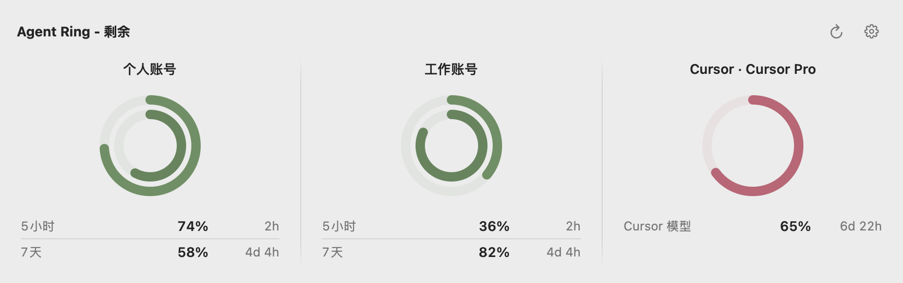
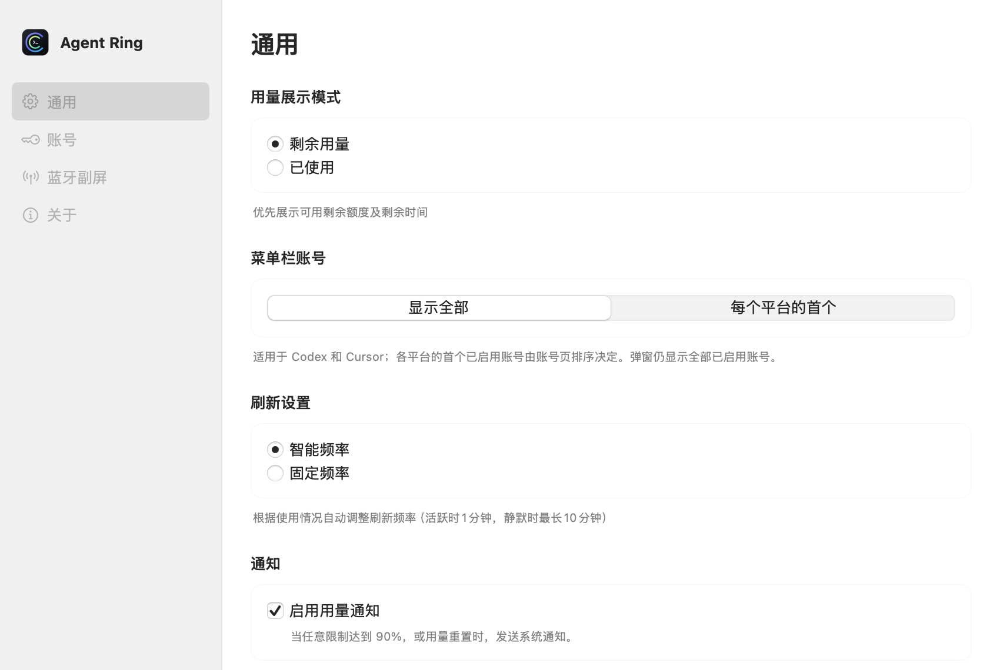
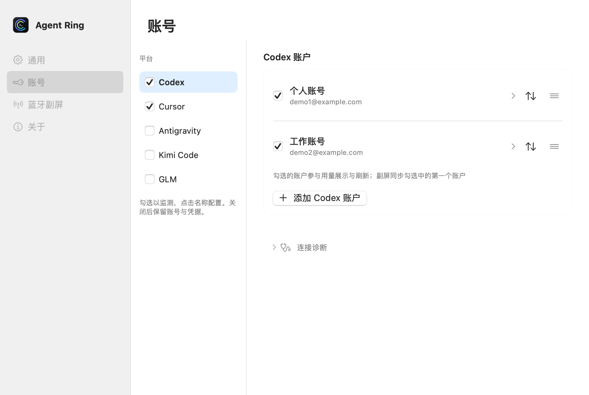
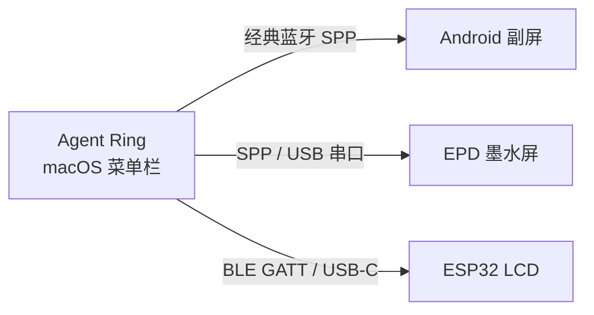

# Agent Ring

[English](README_EN.md) · 简体中文

<p align="center">
  
</p>

<p align="center">
  <strong>macOS 菜单栏上的 AI 用量圆环</strong><br />
  在菜单栏查看 Codex、Cursor、Antigravity、Kimi Code 和 GLM Coding Plan 用量。<br />
  SwiftUI 原生界面，多账号并排展示。
</p>

<p align="center">
  <a href="https://github.com/kkk0913/AgentRing/releases/latest"></a>
</p>

<p align="center">
  
  
  
  
  
</p>

<p align="center">
  
</p>

## 界面预览

| 通用设置 | 账户认证 |
| :---: | :---: |
|  |  |

截图来自 0.2.0 的真实 SwiftUI 视图；账号和用量均为演示数据。

## 下载

**当前状态：0.2.0 已通过云端试打包，尚未公开正式 Release。** 验收包可从 [Release 预览工作流](https://github.com/kkk0913/AgentRing/actions/workflows/release.yml) 的 Artifacts 下载（需要登录 GitHub）；下面的 Latest Release 在正式发布后可用。

1. 打开 [Latest Release](https://github.com/kkk0913/AgentRing/releases/latest)
2. 下载 `AgentRing-*-macos.dmg`（0.2.0 候选包约 8 MB，同时支持 Apple Silicon / Intel）
3. 退出旧版，打开 DMG，将 `AgentRing.app` 拖入「应用程序」并选择替换
4. 若系统提示无法验证开发者，在「系统设置 → 隐私与安全性」中选择「仍要打开」

> 发布包使用 ad-hoc 应用签名，未经 Apple 公证。安装含 Sparkle 的版本后，应用内更新会验证 EdDSA 签名并自动安装重启；更早版本需要手动覆盖安装一次。

## 功能

- **多账号同时展示**：Codex、Cursor 账号独立勾选、设置别名和拖动排序；菜单栏可显示全部账号或每个平台的首个账号。
- **平台独立启停**：账号页左侧勾选监测平台，点击名称配置；关闭监测保留账号和凭据。
- **原生设置界面**：系统侧栏、复选框、浅色内容区，支持窗口缩放及中英文、深浅色切换。
- **紧凑用量弹框**：圆环、已用/剩余百分比和重置时间并排展示；根据屏幕宽度折行，内容过多时分页。
- **明确的刷新状态**：智能刷新；账号加载或失效时保留菜单栏位置。Cursor 请求失败时标明旧数据与上次成功更新时间。
- **快捷入口**：点击菜单栏图标查看用量，弹框右上角提供刷新和齿轮设置入口。
- **副屏同步**：支持既有蓝牙/USB 副屏生态；同步范围见下文。

## 平台与认证

| 平台 | 接入方式 | 多账号 / 注意事项 |
| :--- | :--- | :--- |
| Codex | 登录授权；兼容已有 Session Token | 多账号独立用量，OAuth 凭据支持自动续期 |
| Cursor | 网页登录会话 | 多账号独立请求、排序与失效提示 |
| Antigravity | 探测本机客户端凭据 | 保留现有方案 |
| Kimi Code | Kimi Code API Key，选择国内或国际区域 | 单份配置；不是 Moonshot 按量 API Key |
| GLM Coding Plan | API Key，选择智谱或 Z.ai 区域 | 单份配置；监测 Coding Plan 额度 |

进入 **设置 → 账号**，点击左侧平台名称完成配置。Kimi Code / GLM 填写 API Key 后点击“验证并启用”。Codex / Cursor 的账号复选框控制是否监测，拖动调整展示顺序。

凭据在本机加密保存。旧版 Kimi 本地 Token 需要重新配置为 API Key。Kimi / GLM 已通过模拟接口回归检查，真实账号结果仍需验收；接口未提供的重置时间显示为“—”。TypeSafe、MiMo 尚未接入。

## 副屏生态

目前副屏协议支持 Codex、Cursor 和 Antigravity，Kimi / GLM 暂不参与同步。多账号平台同步第一个启用账号。

Agent Ring 不只是菜单栏小圆环。Mac 端采集用量后，可以把同一套数据推到工位旁的第二块屏上——经典蓝牙、BLE 或 USB 直连，不经过云端。设置里打开「蓝牙副屏同步」即可，支持 1:N，多块副屏可同时在线。



| 产品 | 适合谁 | 连接方式 | 仓库 |
| :--- | :--- | :--- | :--- |
| **Agent Ring** | macOS 菜单栏主应用 | — | 本仓库 |
| **Android 副屏** | 闲置 Android 手机 / 小平板 | 经典蓝牙 SPP | [davidhoo/agentRing-Android](https://github.com/davidhoo/agentRing-Android) |
| **EPD 墨水屏** | 4.2" 三色电子纸摆件 | 经典蓝牙 SPP / USB 串口 | [davidhoo/agentRing-EPD](https://github.com/davidhoo/agentRing-EPD) |
| **ESP32 LCD** | ESP32-P4 7" IPS 触摸屏 | BLE 5.0 GATT / USB-C | [haorui-lab/agentRing-ESP32-LCD](https://github.com/haorui-lab/agentRing-ESP32-LCD) |

### [agentRing-Android](https://github.com/davidhoo/agentRing-Android)

手头有一台闲置 Android 设备，就可以把它变成桌面监视器。兼容 Android 5.0+，屏幕常亮、沉浸全屏，经经典蓝牙 SPP 实时同步用量、同心圆环与重置倒计时。

### [agentRing-EPD](https://github.com/davidhoo/agentRing-EPD)

给喜欢折腾墨水屏的人准备的桌面摆件。适配 4.2" 黑白红三色电子纸（400×300），数据变化才刷新，经典蓝牙 SPP 与 USB 串口双通道，适合长时间常显、低功耗。

### [agentRing-ESP32-LCD](https://github.com/haorui-lab/agentRing-ESP32-LCD)

给 ESP32 开发板准备的 IPS 副屏固件。面向微雪 ESP32-P4 7" 1024×600 电容触摸屏，LVGL 9 渲染，BLE 5.0 GATT 通电即连，也可走 USB-C 串口，无需在系统设置里手动配对。

想自己做一块屏？JSON 帧格式与连接约定见 [`docs/BLUETOOTH_PROTOCOL.md`](docs/BLUETOOTH_PROTOCOL.md)。欢迎适配更多硬件。

## 从源码构建

**要求**：macOS 13+、Xcode 26+

```bash
git clone https://github.com/kkk0913/AgentRing.git
cd AgentRing
open AgentRing.xcodeproj
```

在 Xcode 中选择 scheme **AgentRing**，按 `⌘R` 运行。应用图标将出现在菜单栏。

命令行构建：

```bash
xcodebuild -project AgentRing.xcodeproj -scheme AgentRing \
  -configuration Debug -derivedDataPath ./build-temp build \
  && open ./build-temp/Build/Products/Debug/AgentRing.app
```

## 系统要求

- macOS 13.0+
- Apple Silicon 或 Intel

## 文档

- 0.2.0 更新说明：[`docs/release-0.2.0.md`](docs/release-0.2.0.md)

- 蓝牙副屏协议：[`docs/BLUETOOTH_PROTOCOL.md`](docs/BLUETOOTH_PROTOCOL.md)
- 发布流程：[`docs/RELEASING.md`](docs/RELEASING.md)
- 应用内更新：[`docs/auto-update.md`](docs/auto-update.md)

## 参与贡献

欢迎 Issue 和 Pull Request。副屏适配请遵循蓝牙协议规范，并在对应的 Android / EPD / ESP32 仓库提交。

## 开源协议

[MIT License](LICENSE)

基于 [f-is-h/Usage4Claude](https://github.com/f-is-h/Usage4Claude) 分支演进，致谢上游作者。

## 说明

- Bundle ID 为 `app.agentring.AgentRing`；首次升级会从旧 ID `app.agentsring.AgentsRing` 迁移钥匙串与偏好设置。对外显示名为 **Agent Ring**。


本分支基于 [haorui-lab/agentRing](https://github.com/haorui-lab/agentRing)，保留原项目署名和许可证。
