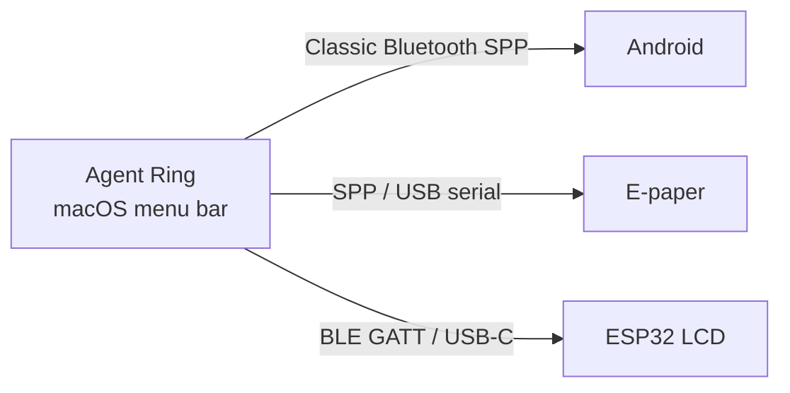

# Agent Ring

[简体中文](README.md) · English

<p align="center">
  
</p>

<p align="center">
  <strong>AI usage rings in your macOS menu bar</strong><br />
  Track Codex, Cursor, Antigravity, Kimi Code, and GLM Coding Plan usage from your menu bar.<br />
  Native SwiftUI. Multiple accounts, side by side.
</p>

<p align="center">
  <a href="https://github.com/kkk0913/AgentRing/releases/latest"></a>
</p>

<p align="center">
  
  
  
  
  
</p>

<p align="center">
  
</p>

## Interface Preview

| General Settings | Account Auth |
| :---: | :---: |
|  |  |

Screenshots show the actual 0.2.0 SwiftUI views with demo accounts and simulated usage.

## Download

**Status: 0.2.0 has passed the cloud release preview; no public release has been published yet.** Download the candidate from the [Release workflow](https://github.com/kkk0913/AgentRing/actions/workflows/release.yml) artifacts (GitHub sign-in required). Latest Release below becomes available after publication.

1. Open [Latest Release](https://github.com/kkk0913/AgentRing/releases/latest)
2. Download `AgentRing-*-macos.dmg` (the 0.2.0 candidate is about 8 MB; universal Apple Silicon / Intel)
3. Quit the old version, open the DMG, and drag `AgentRing.app` into Applications, replacing the old copy
4. If macOS blocks it, use **System Settings → Privacy & Security → Open Anyway**

> Builds are ad-hoc signed and not Apple-notarized. Sparkle verifies in-app updates with EdDSA signatures before installing and restarting. Users of pre-Sparkle versions need one manual replacement installation.

## Features

- **Multiple accounts at once**: independently enable, rename, and reorder Codex and Cursor accounts. Show all accounts or the first enabled account per provider in the menu bar.
- **Provider controls**: check providers to monitor and click their names to configure them. Disabling monitoring retains accounts and credentials.
- **Native settings**: a system sidebar, checkboxes, a light content area, resizable windows, light/dark appearance, and Chinese/English localization.
- **Compact popover**: rings, used/remaining percentages, and reset times. Columns wrap to fit the screen and paginate when needed.
- **Visible refresh state**: smart refresh and stable menu bar positions while loading or signed out. Cursor failures label cached data with its last successful update time.
- **Quick access**: click the menu bar icon for usage; refresh and gear buttons sit at the top right of the popover.
- **Companion sync**: supports the existing Bluetooth/USB display ecosystem, with the provider limits noted below.

## Providers and Authentication

| Provider | Authentication | Accounts / Notes |
| :--- | :--- | :--- |
| Codex | Sign-in authorization; existing Session Tokens remain supported | Multiple accounts; OAuth credentials can refresh automatically |
| Cursor | Web login session | Independent requests, ordering, and authentication errors per account |
| Antigravity | Local client credential discovery | Existing integration retained |
| Kimi Code | Kimi Code API Key; select China or international region | One configuration; not a Moonshot pay-as-you-go API key |
| GLM Coding Plan | API Key; select Zhipu or Z.ai region | One configuration; monitors Coding Plan quota |

Open **Settings → Accounts** and select a provider on the left. For Kimi Code / GLM, enter an API key and choose **Verify & Enable**. Codex / Cursor account checkboxes control monitoring; drag accounts to set their display order.

Credentials are stored encrypted locally. Legacy Kimi local-server tokens must be replaced with API keys. Kimi / GLM have passed mocked API regression checks; real-account results still require acceptance testing. Unavailable reset times appear as “—”. TypeSafe and MiMo are not integrated.

## Companion Display Ecosystem

The companion protocol currently supports Codex, Cursor, and Antigravity. Kimi / GLM are not synchronized. For multi-account providers, the first enabled account is used.

Agent Ring is the data source. After it collects quota on the Mac, it can push the same rings to a second screen on your desk — over classic Bluetooth, BLE, or USB, with no cloud in between. Turn on **Bluetooth companion sync** in Settings. 1:N is supported, so several displays can stay online at once.



| Product | Best for | Transport | Repository |
| :--- | :--- | :--- | :--- |
| **Agent Ring** | macOS menu bar host | — | This repo |
| **Android companion** | Idle Android phone / small tablet | Classic Bluetooth SPP | [davidhoo/agentRing-Android](https://github.com/davidhoo/agentRing-Android) |
| **EPD companion** | 4.2" three-color e-paper desk gadget | Classic Bluetooth SPP / USB serial | [davidhoo/agentRing-EPD](https://github.com/davidhoo/agentRing-EPD) |
| **ESP32 LCD** | ESP32-P4 7" IPS touch panel | BLE 5.0 GATT / USB-C | [haorui-lab/agentRing-ESP32-LCD](https://github.com/haorui-lab/agentRing-ESP32-LCD) |

### [agentRing-Android](https://github.com/davidhoo/agentRing-Android)

Turn an idle Android 5.0+ phone into a desk monitor. Always-on immersive display; live quota, concentric rings, and reset countdowns over classic Bluetooth SPP.

### [agentRing-EPD](https://github.com/davidhoo/agentRing-EPD)

A low-power e-paper desk gadget. Built for a 4.2" black/white/red panel (400×300), refreshes only when quota changes, and accepts both classic Bluetooth SPP and USB serial.

### [agentRing-ESP32-LCD](https://github.com/haorui-lab/agentRing-ESP32-LCD)

Firmware for an ESP32-P4 7" 1024×600 IPS capacitive panel (Waveshare), rendered with LVGL 9. Connects over BLE 5.0 GATT as soon as it powers on, or over USB-C serial — no manual pairing in System Settings.

Building your own display? Frame format and connection rules live in [`docs/BLUETOOTH_PROTOCOL.md`](docs/BLUETOOTH_PROTOCOL.md). Additional hardware ports are welcome.

## Building from Source

**Requires**: macOS 13+, Xcode 26+

```bash
git clone https://github.com/kkk0913/AgentRing.git
cd AgentRing
open AgentRing.xcodeproj
```

Select scheme **AgentRing**, press `⌘R`. The app icon appears in the menu bar.

CLI build:

```bash
xcodebuild -project AgentRing.xcodeproj -scheme AgentRing \
  -configuration Debug -derivedDataPath ./build-temp build \
  && open ./build-temp/Build/Products/Debug/AgentRing.app
```

## Requirements

- macOS 13.0+
- Apple Silicon or Intel

## Docs

- 0.2.0 release notes (Chinese): [`docs/release-0.2.0.md`](docs/release-0.2.0.md)

- Bluetooth companion protocol: [`docs/BLUETOOTH_PROTOCOL.md`](docs/BLUETOOTH_PROTOCOL.md)
- Release process: [`docs/RELEASING.md`](docs/RELEASING.md)
- In-app updates: [`docs/auto-update.md`](docs/auto-update.md)

## Contributing

Issues and pull requests are welcome. Companion-display ports should follow the Bluetooth protocol and land in the matching Android / EPD / ESP32 repository.

## License

[MIT](LICENSE). Forked from [f-is-h/Usage4Claude](https://github.com/f-is-h/Usage4Claude) — thanks to the upstream author.

## Notes

- Bundle ID is `app.agentring.AgentRing`. On first upgrade, credentials and preferences migrate from the legacy ID `app.agentsring.AgentsRing`. Display name is **Agent Ring**.


This fork is based on [haorui-lab/agentRing](https://github.com/haorui-lab/agentRing); original attribution and license are retained.
